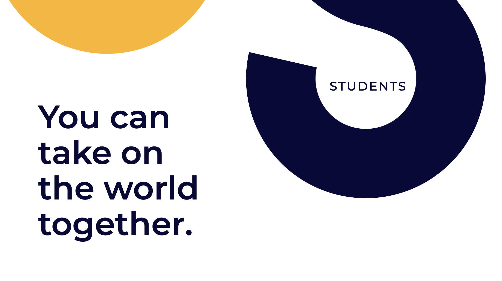
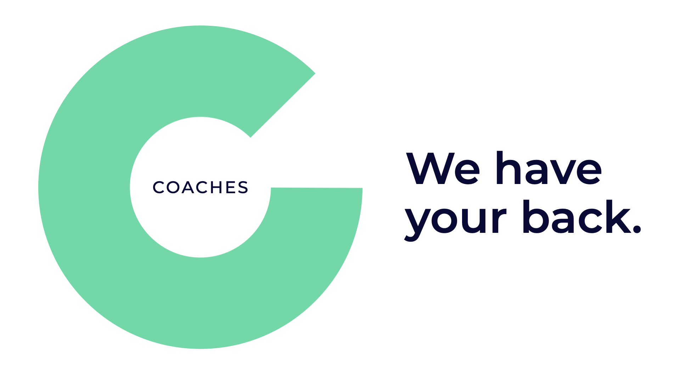

# Welkom op Cityhacks!

Deze wiki is gemaakt als gids voor de deelnemers aan Cityhacks: studenten, coaches, docenten, .... om ook zonder elkaar te zien alles in goede banen te leiden.

## Wat iedereen moet weten voordat we starten aan Cityhacks!

* Waaraan we zullen we werken: [De Uitdaging](projects.md)
* [Wat we kei belangrijk vinden](way-of-work.md)
* Hoe we dat organizeren [zonder elkaar te zien](working-together-in-a-remote-setting.md)

You're always free to break the rules; as long as you're trying to make it a better experience!

### Studenten

Ow yeah, het gaat helemaal de max worden. We kunnen niet wachten om jullie te ontmoeten, online dan.

* Heb je vragen over wat er precies gaat gebeuren? Duik in het [programma van de Cityhacks](programma/programma-remote-edition/)
* Wil je Cityhacks winnen of heb je gewoon stress voor het jurymoment? Check alle details [over de Pitches](programma/24.10-pitches/)
* Aan het worstelen met [Discord](tools/discord/) of op zoek naar de details over de [open data](tools/the-open-data.md)

See you soon!

### Coaches

Woah, We zijn zo blij dat we op jullie mogen rekenen voor deze hackathon!

Zie hier, een beetje meer details over wat je tijdens Cityhacks zal tegenkomen:

* Heb je vragen over wat er precies gaat gebeuren? Duik in het [programma van de Cityhacks](programma/programma-remote-edition/)
* Alle [praktische vragen over Cityhacks](coaching/attend/) - waar, wanneer en wat er precies van jou verwacht wordt.
* Wat [de coaching job precies inhoudt en wat praktische tips hierbij om het allemaal vlot te laten verlopen](coaching/the-coaching-job/).
* Wat [de jury belangrijk vindt](coaching/jurybeoordeling.md) - en je dus best ook leest als jullie willen winnen :\)

## More questions?

* Organisatorische vragen, contacteer Michiel Van den Berghe on discord, or mail [michiel@derepubliek.be](mailto:michiel@derepubliek.be)
* Vragen over de Data, contacteer Steven via discord, of mail [steven.devriendt@brugge.be](mailto:steven.devriendt@brugge.be)
* Wat moet ik doen vragen, contacteer Hannes op discord, of mail [hannes@nerdlab.be](mailto:hannes@nerdlab.be) 
* Vragen over coaching? Contacteer Julie via discord of mail [julie.naesens@ocwest.be](mailto:julie.naesens@ocwest.be)


🚧 This wiki is _always_ under construction — if something is missing or wrong, please contact us at info@osoc.be; and we'll make sure to fix it. 🚧

You are welcome to contribute as well!


## We can't wait to see you!!!!

