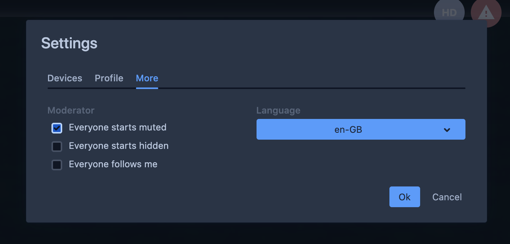
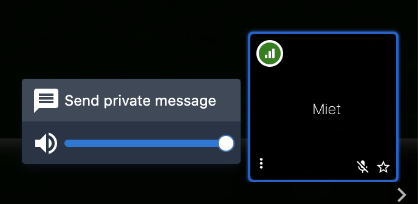
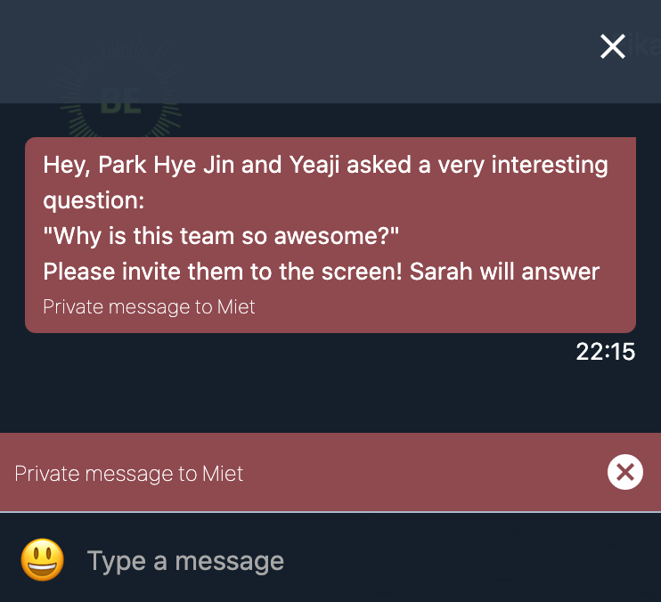
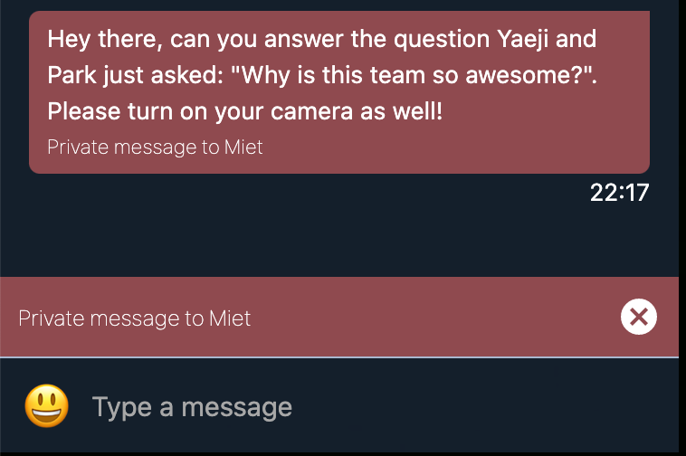

# Hosting

## TDLR \(yes, too didn't long read\); Todo's

### Day before

* [Divide](hosting.md#get-ready-as-a-team-and-divide-work) the work
* Have a [welcome slide](hosting.md#set-the-stage) while people come in, and a [goodbye slide](hosting.md#set-the-stage) to say goodbye

### An hour before

* [Be in your breakout room first](hosting.md#pick-a-noise-and-troll-moderator), at the start of the pitch stream already.

### During

* [Keep the noise down](hosting.md#pick-a-noise-and-troll-moderator)
* Make sure not more than 30 people are in the room at the same time. Kindly ask them to leave in-chat, or[ kick them if](hosting.md#pick-a-noise-and-troll-moderator) needed.
* [Welcome](hosting.md#pick-a-master-of-ceremony-to-welcome-people) people \(and use the slides\)
* [Show off](hosting.md#pick-who-will-show-the-demo-a-website) what you've made
* [Moderate](hosting.md#pick-a-question-moderator) questions

## Get Ready as a Team & Divide work

During the breakout sessions, the whole team is present in the breakout room to welcome visitors, show off their work and answer questions \(just like in a live edition where they'd come to your booth!\).

During the demo day **you won't not roam around**, only visitors will \(to make sure we do not overload the servers\). The team is present the assigned breakout waiting for their visitors.

_This is a chance for you to present yourself to future employers, meet like-minded people and to show people what you've made. Use it as an opportunity_ 😊


During the first breakout room test it was clear this job can get quite heavy; so you can definitely split up tasks over your team members and coach\(es\)!


## Pick a Noise & Troll Moderator

Make sure one person in your team is in the breakout room _first_ to become the moderator. This will give you the opportunity to turn off people's mics, hide them or kick them.

_Tip: You can already go there when the streaming event starts, so you have the chance to chase out the trolls._

### **Keep Down the Noise**

If everybody starts talking at the same time, _you're gonna have a bad time_. Only the person speaking should have their microphone on, on their turn. Your team members can manage their own microphone.

#### Start Off Quiet

You can make sure everyone starts out muted in the settings menu option to prevent starting off noisy.

#### Manage people's noise

If someone forgets to mute themselves after they've just spoken, you can mute them by clicking the three dots bottom left of their name.  
  
However, if one person is speaking, and several other people are noisy, you can mute everyone else but this person.

If you're speaking and people are noisy, you can mute everyone 😇

### Don't Feed the Trolls. Kick them.

But make sure you're not a troll yourself by using this power foolishly!

**If the room exceeds 30 people**, kindly send them a personal message that the room is full and refer them to one of the other 3 \(or 4\) rooms are available. Prepare a little text in advance, so you can easily copy-paste it ;-\) If they will not leave by themselves, kick them!

## Set the Stage

1. Make sure everyone knows what will happen during the breakout session; and what is expected of them. Prepare a slide to welcome everyone, and outline the rules.
   1. If people are shy, you can add example questions to the chat!
2. Share your contact details in the end! Network mode 🔥

Our wonderful Aïsha prepared a template for you:



## Pick a Master of Ceremony to Welcome People

Make sure people feel welcome in your temporary home!

* Welcome everyone!
* Ask visitors to add a name
* Motivate visitors to ask questions in the chat
  * Ask visitors to come on screen with the team and turn on their mic while answering the question.
* Add suggestions, invite team members to show a demo, share websites, ...

### **Make sure people make themselves recognisable**

Urge people to enter a name, so we know who to address. This makes it easier to interact with each other.

### How to adapt your name

## Pick Who Will Show the Demo, a Website, ...?

Multiple people can take on this role, but the most important part is that you made good agreements about it.

## Pick a Question Moderator

The Master of Ceremony might need some backup while answering questions, especially if there's a lot of people in there.

### Keep an eye on questions

A lot of questions coming in? Help out the host.

* Pick interesting and bundle similar questions
* Give the hosts a heads up on:
  * which question is going to be answered
  * who posed the question \(and thus who to invite to the screen with mic\)
  * who will answer the question \(the team member that can answer; this is especially useful in bigger teams\)

#### How to delegate

1. Use discord
2. Use the DM function in Jitsi


Good luck and remember to have fun 🤩


