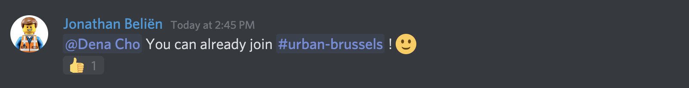
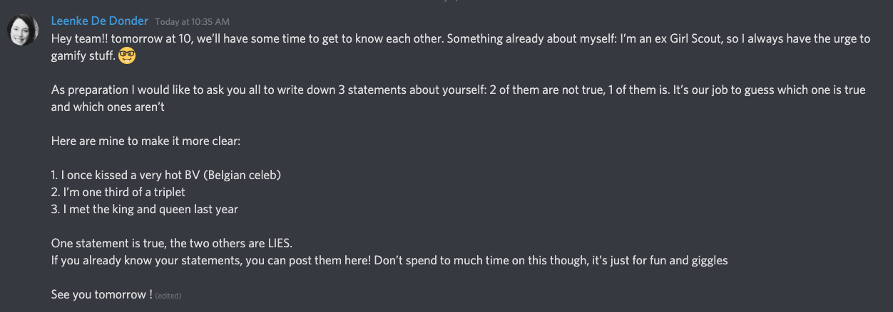
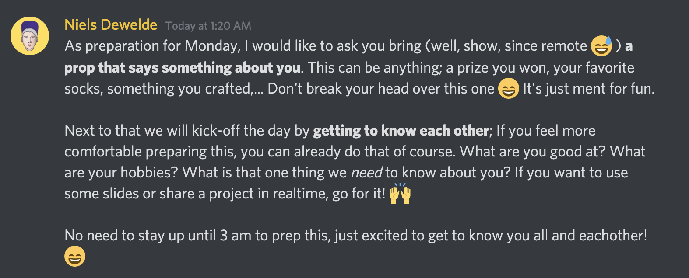

# Kennismaking met je team

Hieronder een paar tips hoe je dit kan doen, maar doe gerust je eigen ding!

## Ijsbreker

Zorg dat de studenten na de Datadive de weg vinden naar het juiste channel. Als ze een account hebben gemaakt, kan je dat zo doen:

Het eerste uur tijdens Cityhacks kan wat ongemakkelijk zijn, zeker in remote versie. Breng je team samen op Discord en zorg voor een ijsbreker. Een paar voorbeelden:

* Vraag aan je teamleden om zich voor te stellen aan de hand van een voorwerp of een dier.
* Bereid wat vraagjes voor die het ijs wat kunnen breken: 

  * Wat is je topeigenschap?
  * Welke app gebruik je het meest?
  * Welke sport beoefen je?
  * Wat is je lievelingseten?
  * Wat is het belangrijkste dat we over jou moeten weten?

Op Cityhacks spreken we voornamelijk Nederlands, maar hierbij een paar voorbeeldjes van hoe dat op andere remote hackathons gebeurde.

