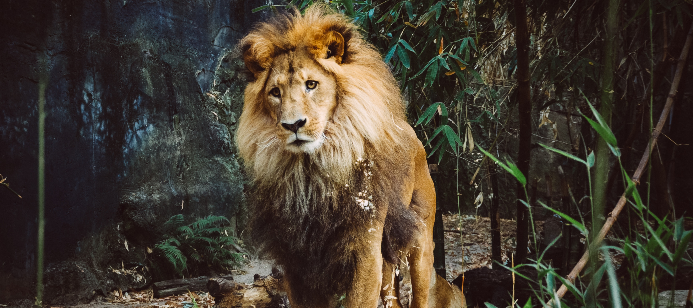

# Motivator, inspirator, coach

## Wees hun leeuw

Sta achter je team. Wijs hen de weg om het beste uit zichzelf te halen. Steun hen en moedig hen aan om van de vertrouwde paden te gaan en grenzen te verleggen. Als zij schitteren, schitter jij. 

Photo by [Tom Skarbek-Wazynski](https://unsplash.com/@wazynski?utm_source=unsplash&utm_medium=referral&utm_content=creditCopyText) on [Unsplash](https://unsplash.com/?utm_source=unsplash&utm_medium=referral&utm_content=creditCopyText)

## Bescherm je team

Je beschermt je team tegen :

* **Hun eigen \(over\)enthousiasme**. Ambitie en drive zijn knappe eigenschappen. Maar als coach zal je misschien af en toe je team weer met beide voetjes op de grond moeten zetten. Stel haalbare doelen en stimuleer hen die te halen
* **Elkaar.** Als coach probeer je de neuzen zoveel mogelijk in dezelfde richting te zetten. Door takenverdeling op basis van kennis en vaardigheden kan ieder lid van het team uitblinken.
* **Jouw \(over\)enthousiasme.** Het is soms moeilijk om iemand te zien worstelen met een probleem. Maar dat wil daarom niet zeggen dat jij de taak moet overnemen. Geef uitleg, maak het concreet met voorbeelden. Laat je studenten het voornamelijk zelf uitzoeken. Zo leren en onthouden ze het best!

Photo by [Samuel Scrimshaw](https://unsplash.com/@samscrim?utm_source=unsplash&utm_medium=referral&utm_content=creditCopyText) on [Unsplash](https://unsplash.com/search/photos/lion-roar?utm_source=unsplash&utm_medium=referral&utm_content=creditCopyText)

## Laat hen het werk doen

Je studenten zijn hier om te leren. Ook fouten maken is een leerproces. 

Photo by [Ihtesham Ismail](https://unsplash.com/@ihtesham94?utm_source=unsplash&utm_medium=referral&utm_content=creditCopyText) on [Unsplash](https://unsplash.com/search/photos/lion-cub?utm_source=unsplash&utm_medium=referral&utm_content=creditCopyText)

## Zorg voor elkaar

Er zijn andere coaches en de organisatoren die jou kunnen helpen. Weet je iets niet of je kan wat advies van een coach met andere achtergrond gebruiken? Je staat er niet alleen voor! Zorg je er ook voor dat de andere coaches zich niet alleen voelen? 

Photo by [Gwen Weustink](https://unsplash.com/@aboeka?utm_source=unsplash&utm_medium=referral&utm_content=creditCopyText) on [Unsplash](https://unsplash.com/?utm_source=unsplash&utm_medium=referral&utm_content=creditCopyText)

## Sharing is caring

Hebben jullie iets nieuws geleerd? Een interessante techniek ontdekt? Of iets leuks om te delen met de anderen? Laat het weten aan de andere groepen! Je zal verbaasd zijn hoeveel je zal leren tijdens Cityhacks en hoe tof het is om je kennis en vaardigheden te delen met anderen. 

Photo by [Joss Woodhead](https://unsplash.com/@josswoodhead?utm_source=unsplash&utm_medium=referral&utm_content=creditCopyText) on [Unsplash](https://unsplash.com/?utm_source=unsplash&utm_medium=referral&utm_content=creditCopyText)

## I have no idea what I'm doing

Photo by [Kurt Cotoaga](https://unsplash.com/photos/huXZH43-qiw?utm_source=unsplash&utm_medium=referral&utm_content=creditCopyText) on [Unsplash](https://unsplash.com/search/photos/lion-cub?utm_source=unsplash&utm_medium=referral&utm_content=creditCopyText)

Een hackathon, en al zeker een remote hackathon, is een experiment op zich. Overvalt de twijfel je, heb je even een sparring-partner nodig van de organisatoren/andere coaches? We have your back! We zijn er om elkaar te helpen doorheen dit proces! [Lees dit!](first-time-coaches.md)

