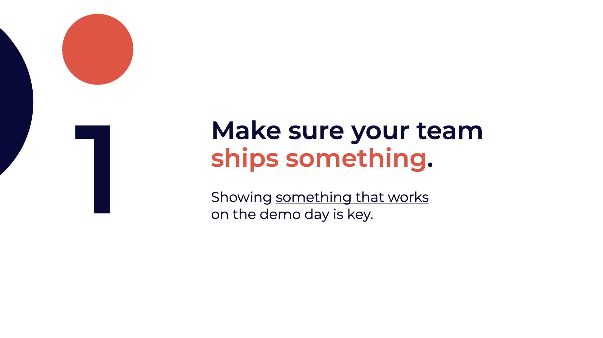
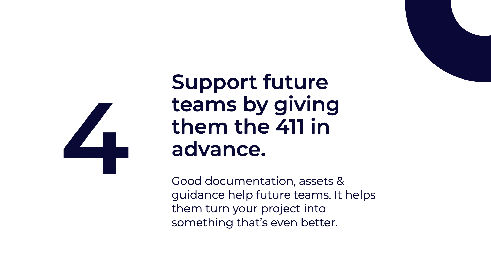
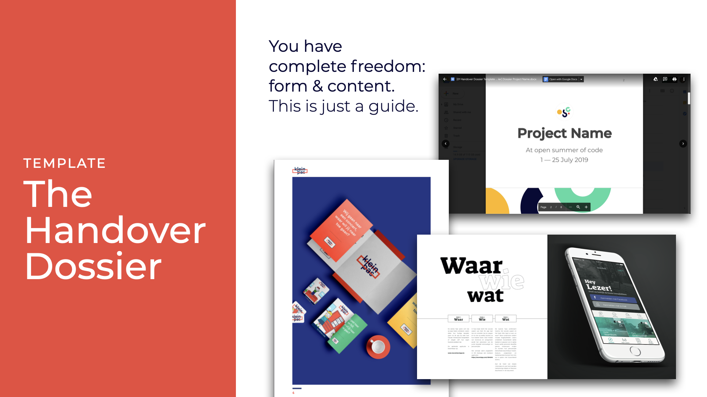
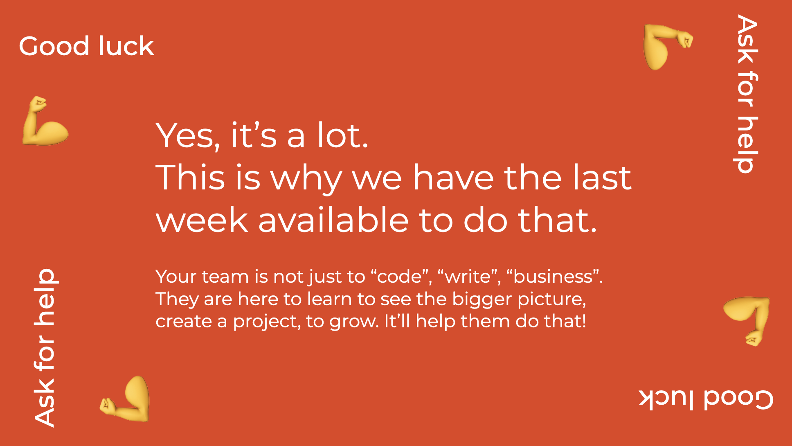

# How to Deliver Like a Pro

You and your other team members will create a lot of valuable things for the client in these 4 weeks. It's important that they get to see it, use and reuse it \(we are _open_!\).

That's why you, as a student, are responsible to make sure you gather and communicate about this!

## Most important

### 1. Make sure you ship something.

Make it something you'll be proud of, and you can show off in your portfolio 😎

### 2. Make sure your client can find & reuse that ship.

Gather everything, document it well and make sure they can find out about where to find everything \(in the team's deliverables folder\) via a handover email at the end of osoc.

### 3. Make the ship discoverable & traceable for interested audiences.

Make sure your project can survive on the internet, and you can refer to it in your portfolio. A link that can won't suddenly be taken down, like for instance on [Github Pages](publishing-a-github-page.md), will help you here.

### 4. Support future teams by giving them the 411 in advance.

Giving someone the 411 means you give them all context and updates they need to hit the ground running; to make sure that they are as informed as possible. It definitely is possible your project returns next year.

So if you are working on a project that has been around the year before, make sure you get your hands on that information!

## The checklist

Step 1: Go to the cloud **folder for students** [https://cloud.openknowledge.be/s/8QHH7oXRSWpY8eK](https://cloud.openknowledge.be/s/8QHH7oXRSWpY8eK)

Step 2: Go to **Deliverables**

Step 3: find the deliverables **checklist**

Step 4: Start **checking** boxes!

## Some help

### The Handover Dossier

**Gather all the knowledge of the team’s project in this dossier.**  
This will help the client understand what kind ship the team has built, how they got to that ship, and where to find everything.

* Find the template in your team folder [https://cloud.openknowledge.be/f/272925](https://cloud.openknowledge.be/f/272925)
* Find examples of the handover dossier here: [https://cloud.openknowledge.be/f/275772](https://cloud.openknowledge.be/f/275772)

### Github Pages

**The internet is volatile. Things disappear. Your effort should not.**  
We want to make sure the project remains findable & traceable even after it’s removed from its domain name, and is still legible by people that don't want to dive in the code.

* Find out how to [create a Github page](publishing-a-github-page.md)
* Get access to a [template](publishing-a-github-page.md#picking-a-template) \[[example](https://osoc20.github.io/gh-pages/)\]

### The Other Deliverables

**Contacting press, user tests, ..**  
Not everything has a guide. But we have many coaches, student coaches and even students to help out. Get in touch!

### The Handover Email

Write a clear, professional email with a link to your deliverables at the end of open summer of code \([see calendar](calendar-remote-edition/week-4-deliver/day-3.md)\) – and a kind goodbye.

### We use the last week to get it done

**Yes, it’s a lot. This is why we have the last week available to do that.**   
our team is not just to “code”, “write”, “business”. They are here to learn to see the bigger picture, create a project, to grow. It’ll help them do that!

