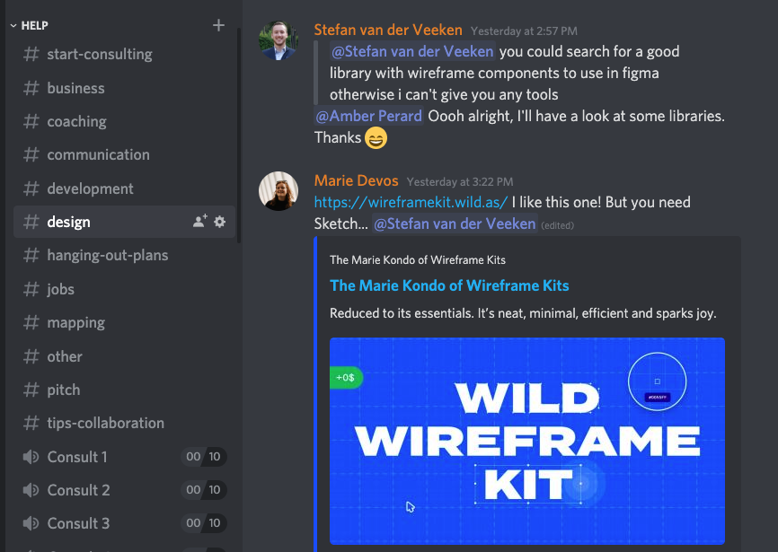

# Offering and Receiving Help

## Asking for Help from Anyone

We have a specific help channel in Discord: **\#all-your-questions** Got a question? Pop in in there. Someone might pick it up 👀.

## The Rubber Duck Debugging Technique

Have you ever asked someone a question, and by asking it, and then you realise you know the answer? Let's avoid the awkward _"Oh never mind.. sorry"_ moment by using the [Rubber Duck Debugging technique](https://en.wikipedia.org/wiki/Rubber_duck_debugging)!

You take rubber \(or imaginary\) duck, and you explain the problem. Out loud. Yes, really. Observe how talking to yourself makes you smarter.

Couldn't figure out find the answer? [Ask in one of the help channels](remote-helping.md#asking-for-help-from-anyone) or [consult a coach](remote-helping.md#asking-for-help-from-coaches)!

You can read more about this technique on [Wikipedia](https://en.wikipedia.org/wiki/Rubber_duck_debugging) – specifically for development. However, it's also useful for problems, like finding out how a certain tool works. Try it and let us know if it worked!

## Asking for Help from Coaches

Please, your coach is there to help, if there is anything don't hesitate to ask questions. If they don't know, they'll find someone who does.

As a coach, whenever you have some time off _– AKA letting your students go 🔥_, you can offer your time to help out others!

