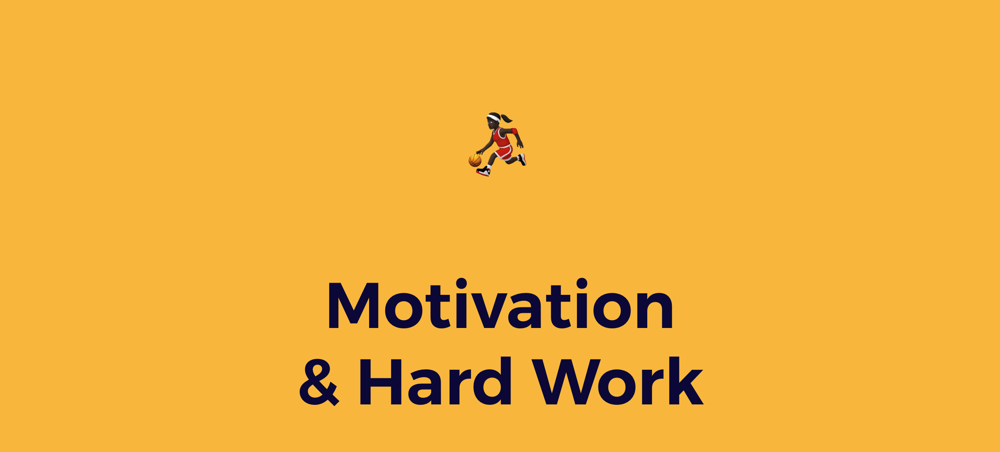
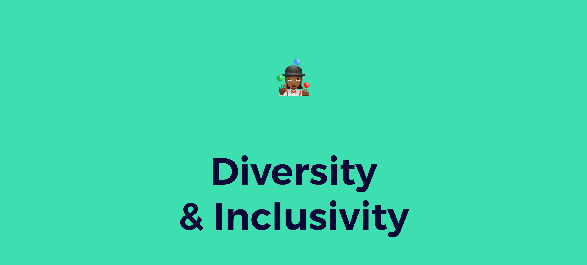

# De Manier van Werken

## **Zo Werken We**

### §1. Locatie en werktijden 

1. Tijdens COVID19 is afstandswerk standaard. Werk vanuit huis of op een locatie die jou een goede werkomgeving biedt. Als er geen geschikte werkplek voor je beschikbaar is, neem dan contact op met je docenten. 
2. Zorg ervoor dat je geplande activiteiten bijwoont met teams, klanten en in groep \(zoals streams, meetings en standups\) zoals gecommuniceerd in de kalender en door je coach. 

### §2 Jouw werk 

1. Je zult je werk zo flink mogelijk doen. Je werk is, tenzij, in enkele zeer zeldzame gevallen anders vermeld, open source en zal worden gedeeld met je buren, dus houd het netjes.
2.  Projecten vallen onder het copyright van 2020 door Cityhacks, jij bent de auteur. Bovenaan elk bestand zou er een copyright-melding en een auteur-melding moeten staan, voordat deze wordt vastgelegd in de GIT-repository. 
3. Als je merkt dat u langer dan 1 uur met een probleem vastzit, vraagt ​​u om hulp. 

### §3 Je bent een ambassadeur

1. Tijdens het evenement kunnen geïnteresseerde mensen \(bijv. Journalisten, potentiële werkgevers, experts\) de locatie betreden. Als ze naar uw project vragen, stop dan met werken en beantwoord ze zo goed mogelijk. 
2. Iedereen in je team is zonder uitzondering een ambassadeur van het project \(ja, ook de back-end coder\). Je legt met trots je project uit en traint jezelf om het project te pitchen alsof het je eigen start-up is. 
3. Het project eindigt niet bij Cityhacks. Je moet proberen je open source-project zo te 'ontwerpen' dat je fier bent als wordt gevraagd om je project later te pitchen, of wanneer je wordt benaderd door journalisten, gevraagd wordt om een ​​evenement bij te wonen, enzovoort.

### §4 What's in a name

Je verwijst naar het evenement  als \# cityhacks20 of "Cityhacks", niet als ~~The Cityhacks~~ 

### §5 Blog & Socials

1. Je wordt aangemoedigd om een ​​blogpost of vlog te schrijven over het project waar je aan werkt tijdens Cityhacks. Laat ook zeker **Michiel** iets weten dan kan hij het verder delen.
2. Mensen houden van foto's, wees niet bang om foto's te maken of afbeeldingen toe te voegen aan de blogpost of online berichten.

## **Jouw Vrijheden**

### §1 Vrijheid om projecten aan te passen

Als u zich niet op uw gemak voelt in uw team, of als u het gevoel heeft dat er een ernstige mismatch is met uw project, zullen we proberen u over te schakelen naar iemand van een ander project met een vergelijkbare rol en vaardigheden. Neem contact op met Hannes op Discord 

### §2 Vrijheid van instrumenten

Behalve voor Git en SSH, ben je vrij om elke software- of hardwarestack te gebruiken die je gewend bent. Je bent vrij om elke technologiestack te gebruiken die het meest geschikt is voor uw project

### §3 Vrijheid om te leren

Je kunt niet alles weten. Het staat je vrij om vragen te stellen aan iedereen in een ander project die de beste expertise over dat onderwerp lijkt te hebben. Je bent vrij om de broncode van elk project op te vragen. 

### §5 Vrijheid van meningsuiting

Je bent vrij om te tweeten met de juiste hashtags \#cityhacks20, Facebook, Instagram, Snapchat of een ander sociaal netwerk te gebruiken wanneer je iets over Cityhacks wilt zeggen. Zolang je andere mensen niet lastigvalt of kwetst.

### \*\*\*\*

