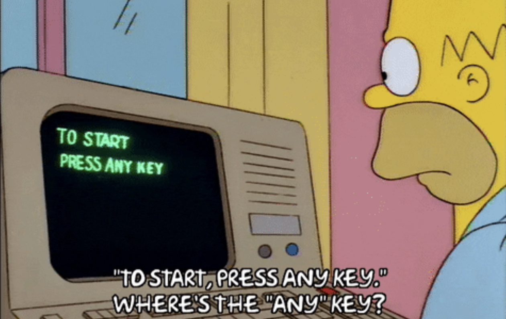
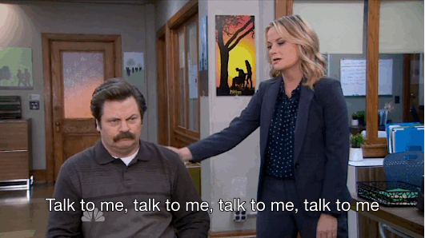
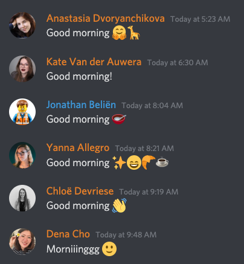
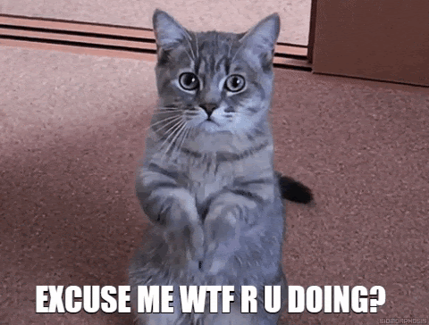
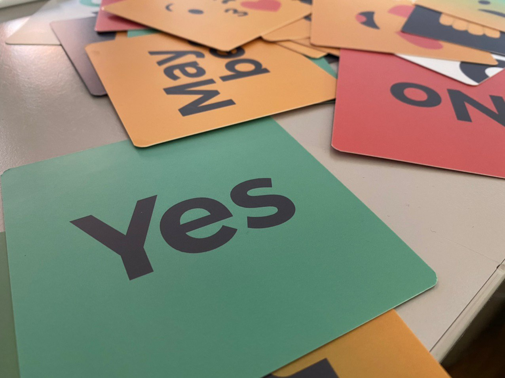
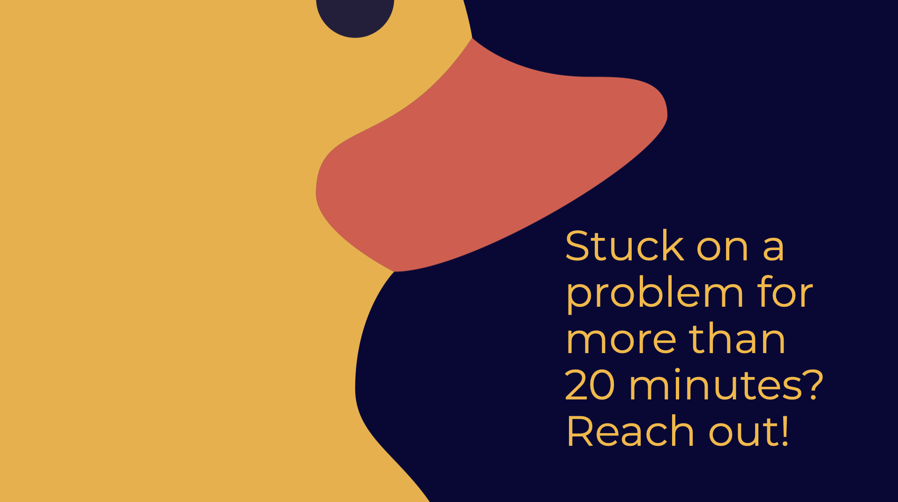
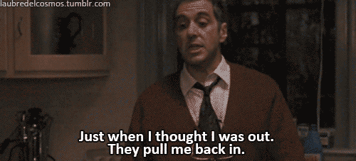

# Samenwerken zonder samen te zitten

## 🎬 Waar moeten we beginnen?

Het is iets nieuws voor ons allemaal, laat ons er iets mooi van maken.

## 📣 Laat van je horen

We kunnen elkaar niet de hele tijd zien of horen \(wat wel het geval is tijdens een live setting\). Dus niemand zal weten als je iets niet zeker weet of als je hulp nodig hebt – Als dat het geval is, laat van je horen.

### Luid werken

Houd je teamgenoten op de hoogte van wat je doet. Werk je taken bij in je projectmanagementtool \(trello, kanban, github, ...\), hang rond in de voicechats, doe af en toe een stand-ups , ... Wat ook werkt voor het team, zorg ervoor dat je weet wat je teamgenoten doen en hoe het met ze gaat!


Vind een manier om in contact te blijven met uw team. Sommige teams hangen graag in voice channels en spelen een deuntje, sommige teams checken af en toe hoe het gaat. Vind wat goed voelt!


Dit is ook van toepassing tijdens vergaderingen; gebruik je mooie kaarten om op video te reageren \(als het geluid niet geschikt is\) of gebruik chat om te bevestigen; er is niets erger dan praten in de leegte.

In het echte leven knikken we of maken we ehmmm geluiden in gesprekken. Remote heeft andere manieren van interactie nodig!

### Vraag om hulp

Blijf niet langer dan 20 minuten vastzitten. Er zijn tal van manieren om hulp te vragen, wees niet bang om dat te doen! Cityhacks is gebouwd om elkaar te helpen, dus we moedigen je aan om hulp te vragen en te geven.

## 👔⚖️⛹🏽‍♀️ Work-Life-Balance

Werken kan heel leuk zijn en de teamdynamiek is opwindend. Het is echter belangrijk om wat tijd weg van je scherm te blijven; om na te denken, op te laden en je hersenen wat tijd te geven om te gaan met de informatie die je elke dag opdoet.

Maak van uw bureau je werkomgeving. Houd het netjes, zodat je je kunt concentreren op waar je goed in bent; kick-ass projecten maken. 

Eet ergens anders als je kan, ook al is het maar een halve meter verwijderd \(we hebben niet allemaal de luxe van verschillende kamers, maar als je kunt, ga dan naar een andere kamer!\). Je kunt zeker wandelen en ook wat frisse lucht binnenlaten in je kantoor🌬

### Neem pauzes


Regelmatige pauzes zijn een must. Maak een afspraak met uw team over hoe je pauzes gaat nemen. 👯‍♂️


## 🎳 Team Play

### Team Work Makes the Dream Work

We hebben jou en je teamgenoten geselecteerd omdat we denken dat jullie over de juiste vaardigheden beschikken om dit project tot leven te brengen, en jullie hebben allemaal waarde te bieden. _**Dat betekent dat je teamgenoten je nodig hebben**_. Neem initiatief en laat zien wat je in huis hebt! 

Voel je je een beetje verloren in je rol? Zeg het maar, vraag om hulp! We doen dit samen.

### Neem dat stuur

Het team mag beslissingen nemen en we verwachten dat je initiatief neemt. Coaches zijn er om je te beschermen / te helpen wanneer situaties moeilijk worden, en om ervoor te zorgen dat je niet in een ijsberg terechtkomt; maar jij hebt de leiding als student.


Neem het heft in handen, sta op! Dit project en het resultaat is van jou 🔥


## 🌊💦🚰💧 Stay Hydrated

